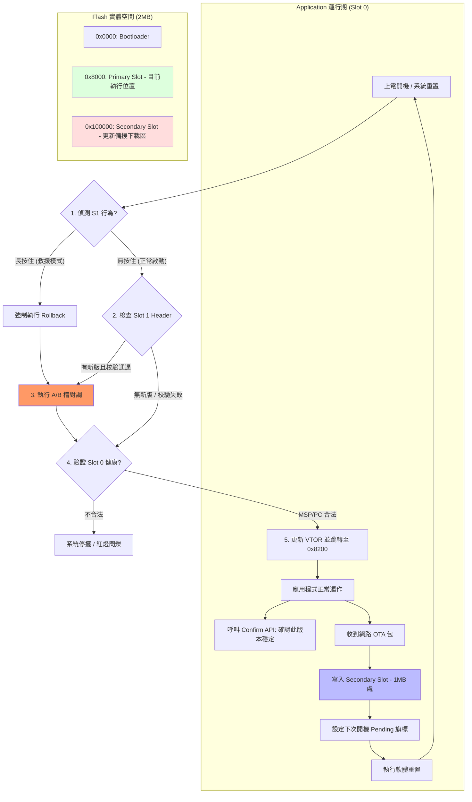

# Renesas EK-RA6M5 Ethernet OTA 專案說明書

本專案實作了基於 Renesas EK-RA6M5 開發板的乙太網路備援與 OTA (Over-the-Air) 更新功能。目前已成功打通底層硬體與 NetX Duo 網路堆疊，支援穩定的 Ping 通訊。

## 1. 檔案與函數功能目錄

### 1.1 應用程式專案 (OTA_RTOS_App)
*   **`src/blinky_thread_entry.c`**：
    *   `blinky_thread_entry()`：核心入口。手動初始化硬體環境並啟動 NetX Duo。
    *   `g_ip0_quick_setup()`：手動補完 FSP 遺漏的 IP 實例化邏輯。
*   **`src/hal_warmstart.c`**：
    *   修補中斷向量表，確保 ThreadX 在非標準位址啟動時依然能正確調度。
*   **`script/fsp.lld`**：
    *   定義 App 起始位址為 **`0x00008200`**。
*   **`finalize_ota.py`**：
    *   負責提取 BIN 並附加 **512B (0x200)** 的 MCUboot 簽署標頭。

### 1.2 引導程式專案 (OTA_Bootloader)
*   **`src/hal_entry.c`**：
    *   驗證位址 **`0x8200`** 處的 MSP 並執行跳轉。

---

## 2. 除錯與解決流程 (Troubleshooting Archive)

這一段記錄了專案開發期間最關鍵的正向工程過程：

### 問題 A：FSP 程式碼產生不完全
*   **現象**：FSP 配置了網路堆疊，但編譯時找不到 `g_ip0` 等網路實例，產生 Linker Error。
*   **原因**：FSP 工具失效，僅產生了配置巨集，卻未產生對齊的 C 代碼實體。
*   **解法**：放棄依賴 FSP 自動產生，改在 `blinky_thread_entry.c` 中**手動實作** `NX_IP` 與 `NX_PACKET_POOL` 的變數宣告與初始化。

### 問題 B：乙太網路硬體「靜默失敗」 (藍燈不亮)
這是最難排除的綜合性故障，最終拆解為三個子問題：

1.  **IOPORT 接腳未導通**：
    *   **原因**：未執行 `R_IOPORT_Open`，導致 RMII 介面接腳處於 High-Z 狀態。
    *   **解法**：在啟動前強制開啟腳位配置。
2.  **模組處於停止狀態 (MSTP)**：
    *   **原因**：RA6M5 預設將乙太網路控制器電源切斷以節能。
    *   **解法**：手動清除 `MSTPCRB` bit 15，強制喚醒 ETHERC 模組。
3.  **TrustZone 記憶體權限衝突 (核心問題)**：
    *   **原因**：EDMAC 是「非安全」裝置，無法存取預設為「安全」區域的普通 RAM，導致 DMA 寫入失敗。
    *   **解法**：將標記為 `g_packet_pool0_pool_memory` 的緩衝區，透過屬性強制放在 **`.ns_buffer` (Non-secure)** 區段。

### 問題 C：PHY 重置不穩定
*   **現象**：冷啟動或重新燒錄後，網路偶爾無法連線。
*   **原因**：硬體重置腳位 (P403) 觸發後，PHY 晶片 (KSZ8091) 需要時間穩定 PLL。
*   **解法**：在重置後加入 **2 秒的停等延遲**，確保 MDIO 通訊前 PHY 已完全就緒。

---

## 3. 操作流程與燈號說明

### 第一階段：Bootloader 引導
1.  **藍燈 (LED1) 亮下**：Bootloader 啟動。
2.  **藍燈 + 綠燈 (LED2) 燈亮**：驗證 0x8200 合法，準備跳轉。
3.  **全滅**：跳轉成功。

### 第二階段：App 運行 (192.168.1.100)
1.  **紅燈 (LED3) 閃爍**：RTOS 心跳正常。
2.  **藍燈 (LED1)**：
    *   **長亮**：硬體物理 Link 成功。
    *   **閃爍**：底層暫存器感應到封包流量。
3.  **綠燈 (LED2) 閃爍**：軟體 NetX Duo 已成功處理 Ping 封包。

## 4. 版本紀錄

| 版本 | 日期 | 狀態 |
| :--- | :--- | :--- |
| v1.0.0 | 2026-04-20 | 基礎環境架設 (ThreadX + NetX Duo) |
| v1.0.1 | 2026-04-21 | 修復 FSP 遺漏代碼，實作手動 IP 啟動。 |
| v1.0.2 | 2026-04-22 | **解決硬體層連線故障**：打通 IOPORT/MSTP/TrustZone；成功 Ping 通 192.168.1.100。 |
| v1.0.3 | 2026-04-22 | 整理技術文檔，確立 0x8200 穩定版配置。 |
| v1.0.4 | 2026-04-22 | **新增 OTA 救援架構圖**：確立 S1 Rollback 與 A/B 槽對調邏輯。 |

---

## 5. OTA 更新與救援架構圖 (Architecture Blueprint)

本專案採用 **MCUboot 雙槽對調 (A/B Swap)** 機制，並輔以 **S1 硬體按鈕** 作為緊急救援手段。

### 5.1 完整引導與更新流程

### 5.2 核心安全機制解說
1.  **S1 按鈕救援 (Manual Rollback)**：當更新後的 App 功能錯誤但未死機時，使用者可透過「開機長按 S1」強行觸發回滾，將 Slot 1 中的舊版穩定程式換回執行區。
2.  **自動驗證 (Signature Check)**：所有寫入 Slot 1 的資料必須通過 SHA-256 哈希校驗，Bootloader 才會執行對調動作，防止因傳輸中斷導致的死機。
3.  **試用期機制 (Confirm/Rollback)**：新程式啟動後若未能在時間內呼叫 `Confirm` API 且發生異常重置，Bootloader 會自動判定更新失敗並換回舊版。

---

## 6. 待做項目 (To-Do List)

### 6.1 應用程式端 (App)
- [ ] **FSP 配置**：加入 `r_flash_hp` (Flash High Performance) 驅動模組。
- [ ] **網路服務**：實作 TCP Server (Port 5000) 用於接收 OTA 二進位檔。
- [ ] **Flash 寫入**：實作分塊寫入邏輯，目標位址為 `1MB (0x100000)`。
- [ ] **資料驗證**：實作 SHA-256 或 CRC 檢查收到的檔案完整性。
- [ ] **狀態更新**：在重置前標記「更新待處理 (Pending)」旗標。

### 6.2 引導程式端 (Bootloader)
- [ ] **按鈕偵測**：實作開機時 S1 (P005) 腳位的狀態讀取。
- [ ] **救援邏輯**：當偵測到 S1 時，強行觸發 Rollback 或維持在 Slot 0。
- [ ] **對調邏輯 (Swap)**：根據標記執行 Slot 0 與 Slot 1 的實體資料搬移。
- [ ] **安全性強化**：利用 MCUboot 的 Header 資訊驗證簽章。

### 6.3 測試與工具 (Testing Tools)
- [ ] **Python 腳本**：撰寫一個電腦端的發送程式，將 `bin` 檔透過 TCP 傳送至板子。
- [ ] **穩定性測試**：模擬「傳輸中斷」、「燒錄錯誤」等場景，驗證系統恢復能力。
