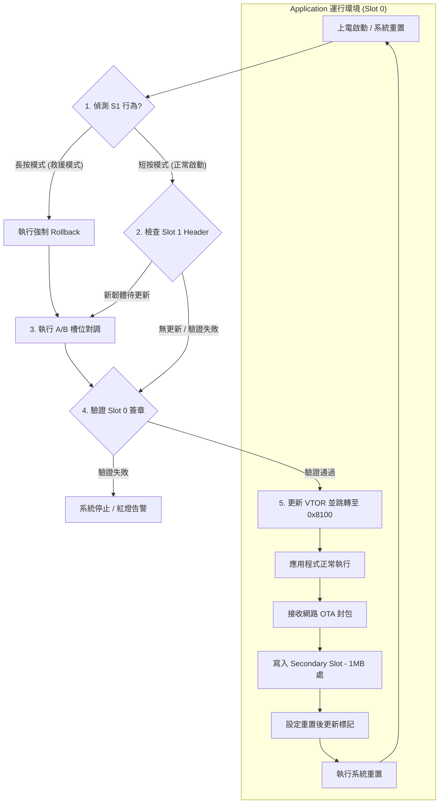

# Renesas EK-RA6M5 Ethernet OTA 開發手冊

本專案實作基於 Renesas EK-RA6M5 開發板與乙太網路架構的 OTA (Over-the-Air) 韌體更新功能。目前已完成 MCUboot 與 FreeRTOS + TCP 網路堆疊的整合。

---

## 💡 目前狀態：Debug-Flat 模式 (開發中)
為了方便開發 App 邏輯（如乙太網路、感測器等），目前的 App 設定為 **直接從 0x0 啟動**，跳過了 Bootloader。

- **App 位址**: `0x00000000`
- **中斷向量表**: `0x00000000`
- **SmartBundle**: 已移除 (不連動 Bootloader 設定)

---

## 🚀 如何復原為 OTA 模式 (正式測試)
當 App 功能開發完成，需要透過 Bootloader 進行簽署與驗證時，請執行以下步驟：

### 1. 恢復記憶體分區 (Solution Memories)
在 `[RA6M5_TCP_OTA] Solution` 的 **Memories** 頁籤中：
- `FLASH_CM33_B` (Bootloader): Start `0x0`, Size `0x8000` (32KB)
- `__BL_0_P_H` (Header Area): Start `0x8000`, Size `0x100` (256B)
- `FLASH_CM33_S` (App Slot): Start **`0x8100`**, Size `0xF7F00` (約 1MB)

### 2. 恢復 SmartBundle 連動 (Build Variables)
1. 對 `ra_primary_app` 點右鍵 -> **Properties**。
2. 進入 **C/C++ Build** -> **Build Variables**。
3. 點擊 **Add...** 新增一個變數：
   - **Name**: `SmartBundle`
   - **Type**: `File`
   - **Value**: `${workspace_loc:/ra_mcuboot}/${ConfigName}/ra_mcuboot.sbd`

### 3. 更新專案並編譯
1. 在 `ra_primary_app` 按 **Generate Project Content**。
2. 執行 **Clean Project** 與 **Build Project**。

### 4. 燒錄驗證 (RFP)
- `ra_mcuboot.srec` -> 位址 `0x0`
- `ra_primary_app.bin.signed` -> 位址 **`0x8000`**

---

## 📊 OTA 架構與流程圖

### 5.1 引導與更新邏輯

---

## 🛠️ 專案開發進度 (To-Do List)

### 6.1 應用程式端 (App)
- [x] **LED 偵測**：完成 P006~P008 腳位配置與閃燈測試。
- [ ] **網路服務**：實作 TCP Server (Port 5000) 用於接收 OTA 影像檔。
- [ ] **Flash 寫入**：實作分塊寫入邏輯，目標位址為 `1MB (0x100000)`。
- [ ] **狀態更新**：在重置前標記「更新待處理 (Pending)」旗標。

### 6.2 引導程式端 (Bootloader)
- [x] **LED 狀態燈**：藍燈(啟動)、綠燈(跳轉)、紅燈(錯誤)。
- [x] **簽章驗證**：MCUboot 成功驗證 App 簽章並跳轉。
- [ ] **按鈕偵測**：實作開機時 S1 (P005) 腳位的長按救援邏輯。

---

## 📝 修復日誌 (Troubleshooting)
- **Problem**: 乙太網路 Ping 不通。
- **Solution**: 開啟 IOPORT (R_IOPORT_Open) 並將 MSTPCRB 的 bit 15 設為 0 以啟動 ETHERC 模組。
- **Problem**: Linker Overflow。
- **Solution**: 在 Solution Memories 中手動劃分 Secure 區域，確保 BL 與 App 位址不衝突。
- **Problem**: **[TrustZone] 網路連線 10 秒後斷線，且 ARP 通但 Ping 不通。**
- **Solution**: 
    1. **記憶體牆修復**：將 Ethernet 描述符與封包池強制搬移至 `.ns_buffer` 段（Non-secure RAM），防止 EDMAC 觸發 ADE 錯誤。
    2. **搬運工權限解鎖**：在啟動時手動修改 `PSARB` (bit 15) 與 `PSARC` (bit 15) 以解鎖 ETHERC 與 EDMAC 的存取權限。
    3. **MAC 位址同步**：確保 FreeRTOS+TCP 堆疊 MAC 與硬體暫存器 MAC 完全一致（同步為 `00:11:22:33:44:55`），防止硬體過濾器誤殺單播封包。
    4. **軟體校驗**：關閉硬體 Checksum Offloading，改用軟體校驗以繞過 TrustZone 對齊限制。
