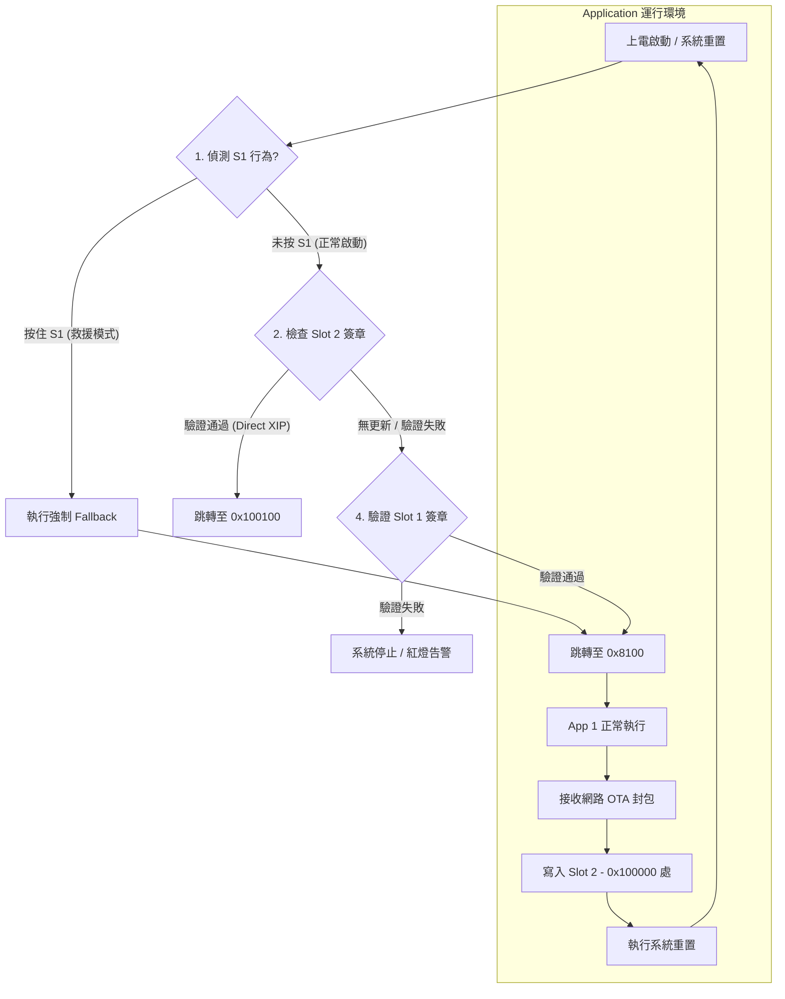

# Renesas EK-RA6M5 Ethernet OTA 開發手冊

本專案實作基於 Renesas EK-RA6M5 開發板與乙太網路架構的 OTA (Over-the-Air) 韌體更新功能。目前已完成 MCUboot 與 FreeRTOS + TCP 網路堆疊的整合。

---

## 💡 目前狀態：全功能 OTA 模式與 Direct XIP 已成功跑通！ 🎉🎉
目前已成功實現：
1. **MCUboot 跳轉 App**（Slot 1 `0x8000`）。
2. **App 1 透過網路接收 App 2** 並寫入 Slot 2 (`0x100000`)。
3. **MCUboot 驗證 Slot 2 成功**，並以 **Direct XIP (原地執行)** 模式成功跳轉至 `0x100100` 執行 App 2 (跑馬燈)！
4. **S1 防磚按鍵救援**功能實測成功，可隨時強制切回 App 1！

- **Bootloader 位址**: `0x00000000`
- **App 1 起點 (Slot 1)**: `0x00008000` (向量表 `0x8100`)
- **App 2 起點 (Slot 2)**: `0x00100000` (向量表 `0x100100`)

---

## 📖 完整操作流程 (Direct XIP 與 防磚測試)

### 流程 A：App 2 升級測試 (Direct XIP 模式)
當您要從 App 1 升級到 App 2，且希望維持 Direct XIP（不搬移韌體）時，請執行以下步驟：

1. **準備 App 2 原始碼**：
   - 在 `ra_primary_app/src/new_thread0_entry.c` 中，將 `#define CURRENT_APP_VERSION` 改為 **`2`**（啟用跑馬燈）。
2. **修改編譯位址 (關鍵)**：
   - 在 `ra_primary_app/script/fsp.lld` 的 `INCLUDE memory_regions.lld` 後方，加上：
     ```lld
     FLASH_START = 0x100100;
     ```
3. **編譯與簽署**：
   - 在 e2 studio 中對著 **Solution 專案** 點擊右鍵 -> **Build Project**。
   - 確認產生的 `ra_primary_app.bin.signed` 檔案時間有更新。
4. **網路傳送**：
   - 啟動板子上的 App 1（綠燈亮）。
   - 執行 Python UI，將簽署好的檔案傳送過去。
5. **重啟驗證**：
   - 檔案傳送完畢後，等待 5 秒超時，板子會自動計算 CRC 並重置。
   - MCUboot 啟動，從 UART Log 會看到 `Image 0 loaded from the secondary slot`，並跳轉至 `0x100100`。
   - **結果**：板子開始閃爍跑馬燈！

---

### 流程 B：S1 按鍵強制救援 (Fallback) 測試
如果 App 2 寫爛了，或是您想手動切回 App 1：

1. **按下 S1**：在板子上電或按下 Reset 的**瞬間**，按住板子上的 **S1 按鍵** (P005)。
2. **觀察燈號與 Log**：
   - 板子會亮起**紅藍齊亮**燈號約 1 秒。
   - UART Log 會印出 `[WARN] S1 Pressed! Forced Fallback to App 1...`。
   - MCUboot 會跳過 Slot 2，直接跳轉至 `0x8000` (App 1) 執行！

---

## 🚀 如何復原為 OTA 模式 (正式測試)
當 App 功能開發完成，需要透過 Bootloader 進行簽署與驗證時，請執行以下步驟：

### 1. 恢復記憶體分區 (Solution Memories)
在 `[RA6M5_TCP_OTA] Solution` 的 **Memories** 頁籤中：
- `FLASH_CM33_B` (Bootloader): Start `0x0`, Size `0x8000` (32KB)
- `__BL_0_P_H` (Header Area): Start `0x8000`, Size `0x100` (256B)
- `FLASH_CM33_S` (App Slot): Start **`0x8100`**, Size `0xF7F00` (約 1MB)

### 2. 恢復 SmartBundle 連動 (Build Variables)
1. 對 `ra_primary_app` 點右鍵 -> **Properties**。
2. 進入 **C/C++ Build** -> **Build Variables**。
3. 點擊 **Add...** 新增一個變數：
   - **Name**: `SmartBundle`
   - **Type**: `File`
   - **Value**: `${workspace_loc:/ra_mcuboot}/${ConfigName}/ra_mcuboot.sbd`

### 3. 更新專案並編譯
1. 在 `ra_primary_app` 按 **Generate Project Content**。
2. 執行 **Clean Project** 與 **Build Project**。

### 4. 燒錄驗證 (RFP)
- `ra_mcuboot.srec` -> 位址 `0x0`
- `ra_primary_app.bin.signed` -> 位址 **`0x8000`**

---

## ↩️ 如何切換回 Debug-Flat 模式 (跳過 Bootloader)
如果您需要單獨開發 App 邏輯，想跳過 Bootloader 直接從 `0x0` 啟動，請執行以下步驟：

1. **移除 SmartBundle 連動**：
   - 進入 `ra_primary_app` 專案屬性 -> **C/C++ Build** -> **Build Variables**。
   - 移除 `SmartBundle` 變數。
2. **修改記憶體分區**：
   - 將 App 的 `FLASH_START` 設回 `0x00000000`。
3. **重新編譯**：
   - 按 **Generate Project Content** 並重新 Build。

*這時的狀態會是：*
- **App 位址**: `0x00000000`
- **中斷向量表**: `0x00000000`
- **SmartBundle**: 已移除 (不連動 Bootloader 設定)

---

## 📊 OTA 架構與流程圖

### 5.1 引導與更新邏輯


---

## 🛠️ 專案開發進度 (To-Do List)

### 6.1 應用程式端 (App)
- [x] **LED 偵測**：完成 P006~P008 腳位配置與閃燈測試。
- [x] **網路服務**：實作 TCP Server (Port 8080) 用於接收 OTA 資料。
- [x] **Flash 寫入**：實作分塊寫入邏輯，成功避開 Dual Mode 斷層。
- [x] **韌體切換**：實作 Direct XIP 模式成功。
- [x] **防磚機制**：實作 S1 按鍵強制 Fallback 成功。

---

## 📡 OTA 使用說明 (TCP Bridge)

目前已實現透過乙太網路遠端寫入 Flash 的功能。

### 1. 板子端準備
*   燒錄最新程式後，確認 **綠燈 (P007)** 恆亮，代表網路已就緒。
*   板子 IP 預設為 `192.168.1.100`，監聽端口 `8080`。

### 2. 電腦端傳送
使用專案根目錄下的 `ota_ui.py` 進行傳送：
1. 選擇簽署好的檔案（例如 `ra_primary_app.bin.signed`）。
2. 輸入板子 IP `192.168.1.100`。
3. 點擊「傳送」，進度條走完後等待板子結算。

### 3. 驗證方式
*   傳送時，板子 **藍燈 (P006)** 會閃爍。
*   傳送完成後，板子會自動結算並重置。

---

## 📝 修復日誌 (Troubleshooting)

- **Problem**: 乙太網路 Ping 不通。
- **Solution**: 開啟 IOPORT (R_IOPORT_Open) 並將 MSTPCRB 的 bit 15 設為 0 以啟動 ETHERC 模組。

- **Problem**: Linker Overflow。
- **Solution**: 在 Solution Memories 中手動劃分 Secure 區域，確保 BL 與 App 位址不衝突。

- **Problem**: **[TrustZone] 網路連線 10 秒後斷線，且 ARP 通但 Ping 不通。**
- **Solution**: 
    1. **記憶體牆修復**：將 Ethernet 描述符與封包池強制搬移至 `.ns_buffer` 段（Non-secure RAM），防止 EDMAC 觸發 ADE 錯誤。
    2. **搬運工權限解鎖**：在啟動時手動修改 `PSARB` (bit 15) 與 `PSARC` (bit 15) 以解鎖 ETHERC 與 EDMAC 的存取權限。
    3. **MAC 位址同步**：確保 FreeRTOS+TCP 堆疊 MAC 與硬體暫存器 MAC 完全一致（同步為 `00:11:22:33:44:55`），防止硬體過濾器誤殺單播封包。

- **Problem**: **[Flash] 調用 R_FLASH_HP_Erase 報錯 FSP_ERR_ERASE_FAILED (0x10004)。**
- **Solution**: 
    1. **硬體權限解鎖**：RA6M5 硬體預設鎖定 Flash 控制器，需手動解鎖 `PSARA` (bit 10) 暫存器權限。
    2. **位址斷層避讓與 Dual Mode 證實**：在實測中，`0x100000` ~ `0x1FFFFF` 區間寫入會失敗。查閱手冊證實晶片處於 **Dual Mode**，Bank 1 的實際起點為 **`0x200000`**。改寫 `0x200000` 後成功解決此問題！
    3. **中斷保護**：在執行 Code Flash P/E 期間必須關閉中斷 (`__disable_irq`) 防止 CPU 存取異常。
    4. **診斷驗證**：透過 `FAWMON` 監控門鎖狀態，確認 `FAWEN` 位元為 1 (Disabled) 以確保門鎖未關閉。

- **Problem**: **[Bootloader] 燒錄後藍燈一直閃爍，App 沒有正常啟動。**
- **Solution**: 
    1. **向量表偏移**：App 被編譯在 `0x0`，但實際燒錄在 `0x8000`。透過在 `solution.xml` 中正確設定分區，並使用「對著 Solution 專案點擊右鍵 -> Build Project」的方式，讓 FSP 自動生成正確的 `FLASH_START = 0x8100` 導正位址。
    2. **堆疊指標 (Stack Pointer) 衝突**：初始堆疊指標被設為 `0x20008000`（RAM 起點），導致堆疊向下生長時踩到 Bootloader。透過修正 `RAM_START` 或是透過 Solution 自動分配，確保堆疊指標在正確的位置。
    3. **TrustZone 邊界衝突**：GDB 顯示晶片處於 SSD 狀態且保留了 64KB Secure Flash。將 App 放在 `0x8000` 剛好落在安全區，導致權限錯誤。未來可能需要將晶片安全區域設為 0 或將 App 後移。

- **Problem**: **[Build] 雖然編譯成功，但 `ra_primary_app.bin.signed` 檔案時間停留在過去，沒有更新。**
- **Solution**: 
    1. **Solution 關聯斷開**：在 e2 studio 中，簽署腳本通常與 Solution 專案的 Build 動作綁定。若單獨 Build 子專案，不會觸發 Post-build 步驟。
    2. **重新建立鏈結**：對著 Application 專案的 `configuration.xml` 重新點擊 **Generate Project Content**，然後務必**對著最外層的「Solution 專案」點擊右鍵 -> 選擇 Build Project**，即可成功觸發 Python 簽署腳本，產生最新的 `.bin.signed`。


名稱SmartBundle
類型:檔案
值:${workspace_loc:/ra_mcuboot}/${ConfigName}/ra_mcuboot.sbd

- **Problem**: **[Solution] e2 studio 的 `solution.xml` 限制 Flash 總大小為 2MB，無法將 Slot 2 設在物理起點 `0x200000`。**
- **Solution**: 
    1. **程式碼強行導正**：在 `ra_mcuboot` 專案中的 `flash_map.c` 檔案裡，取消自動 include `flash_map` 陣列，並手動寫死一個 `flash_map`。
    2. **位址覆蓋**：將 `FLASH_AREA_0S_ID` (Slot 2) 的起點 `.fa_off` 強行設定為 **`0x200000`**，完美繞過工具限制！

---


- **Problem**: **[OTA] 傳送大檔案總是卡在 920KB 左右（魔咒）。**
- **Solution**: 
    1. **狀況**：每次傳送 1MB 的簽署韌體，進度條走到約 920KB 就會卡死，板子再也收不到資料。
    2. **原因**：倒水速度比喝水快。Python 發送資料的速度（原本每 1KB 延遲 5ms）遠快於板子「寫入 Flash + 讓出 CPU 時間」的速度（每 1KB 約需 8~10ms）。這導致板子的 TCP 接收緩衝區在 920KB 處徹底塞滿並溢出。
    3. **解決方法**：我們將 Python 端的傳送延遲調整為 **35 毫秒（0.035秒）**。讓 Python 配合板子的寫入節奏，緩衝區就不會再爆炸，順利突破 920KB，成功達成 100% 傳輸！

- **Problem**: **[OTA] 檔案傳完後，板子不回傳 CRC，導致 Python 超時。**
- **Solution**: 
    1. **狀況**：Python 顯示檔案傳送完畢，但板子遲遲不回傳 CRC 驗證碼，最後超時。
    2. **原因**：FreeRTOS+TCP 不支援 Half-Close（半關閉），當 Python 傳完檔案呼叫 `shutdown(SHUT_WR)` 時，會直接導致連線異常。如果板子一直在等「檔案結束符號」，就會無限乾等。
    3. **解決方法**：
        - 在 Python 端移除 `shutdown`，改為純粹等待。
        - 在板子端設計 **Fallback（防呆）超時機制**：利用 Socket 的 5 秒超時，當板子發現有 5 秒鐘完全沒有新資料進來，且已經收了大於 100KB 的資料時，就「假定傳送已結束」，主動結算並計算 CRC 回傳給 Python！


## 🎉 實戰驗證：App 1 成功接收並驗證 App 2！ (2026-05-08)

我們成功在不依賴 Bootloader 跳轉的情況下，驗證了最核心的「接收與寫入」流程：

### 1. 驗證機制升級
*   將 App 1 的驗證方式從檢查死板的字串，升級為**檢查 MCUboot 官方的 Magic Number (`0x96f3b83d`)**。
*   將寫入位址鎖定在 **`0x200000`**（Bank 1 起點）。

### 2. 測試過程
1.  **產生 App 2**：將 App 版本切換至 2（開啟跑馬燈功能），編譯並產生 `ra_primary_app.bin.signed`，存放在 `app2/` 資料夾。
2.  **降回 App 1**：將 App 版本切換回 1，並修改 `fsp.lld` 覆蓋 `FLASH_START = 0x0` 以便 Debug。
3.  **網路傳送**：執行 `python ota_client.py`（已預設路徑），自動將 `app2` 丟給正在運行的板子。

### 3. 亮麗結果
*   傳送完成後，板子**成功亮起三顆燈 5 秒**！
*   這代表：App 1 成功接收完整檔案、成功寫入 `0x200000`，且**成功辨識出這是合法的 MCUboot 簽署影像**！

---

## 🚀 實戰進展：UART Debug、S1 防磚按鍵與 Direct XIP 模式 (2026-05-12)

我們成功為 Bootloader 加上了調試與安全機制，並探索了 Direct XIP 模式：

### 1. UART9 Debug 系統打通
* **成果**：在 `ra_mcuboot` 中成功初始化 `g_uart9` (P109/P110, 115200)。
* **日誌**：現在開機會印出 `*** MCUboot Bootloader Started ***`，並會在驗證成功時印出跳轉位址。
* **解決 Indexer 假錯誤**：開啟 `Direct XIP` 後 e2 studio 顯示 28 個找不到變數的錯誤，但實際編譯器能順利通過。

### 2. 新增 S1 (P005) 按鍵防磚 fallback 機制
* **成果**：開機時若按住 S1，會亮起紅藍齊亮燈號 1 秒，並強行跳轉到 `0x8000` (App 1)，防止因為 App 2 寫爛導致板子磚化。

### 3. 尚未驗證（待測試）的部分
* **`Direct XIP` 模式執行**：燒錄後 UART 能否印出完整的 `Calling boot_go()...` 且順利跳轉？
* **S1 防磚按鍵功能**：是否真能觸發強跳 `0x8000`。

### 4. 待解決的關鍵問題
* **坑 ①**：App 2 的編譯位址必須改成 `0x200000` (修改 `fsp.lld` 的 `FLASH_START`)。
* **坑 ②**：確認 App 1 接收檔案寫入 `0x200000` 的 Trailer 格式是否能被 BL 認可。

---

## 🎉 終極勝利：Direct XIP 成功運作與 S1 Fallback Bug 修復 (2026-05-13)

我們成功解決了最後的跳轉死機與向量表亂碼問題，達成全功能 OTA：

### 1. Direct XIP 模式實測成功
* **成果**：在 `fsp.lld` 中強行指定 `FLASH_START = 0x100100`，並將 App 版本切換至 2（開啟跑馬燈）。傳送後 MCUboot 成功驗證並跳轉至 `0x100100`，**跑馬燈順利執行**！
* **備註**：先前預期需要編譯在 `0x200000`，但實測發現 MCUboot 會直接跳轉到 Slot 2 的物理起點 `0x100000`，因此將 `FLASH_START` 設為 **`0x100100`** 才是正確的做法！

### 2. 修復 S1 Fallback 向量表亂碼 Bug
* **問題**：按下 S1 強制救援時，UART 顯示向量表為 `0xc74d`（亂碼），導致 PC 跳到非法位址而死機，甚至導致 J-Link 無法連線。
* **原因**：在 `hal_entry.c` 中，我們將 `rsp.br_hdr` 設為 `NULL`，導致系統解引用 NULL 讀到髒資料。
* **解決方法**：將 `rsp.br_hdr` 改為 `(void *)0x8000`，讓它去讀取 Slot 1 現有的 Header，就能正確算出 `0x8100` 的向量表，順利回到 App 1！