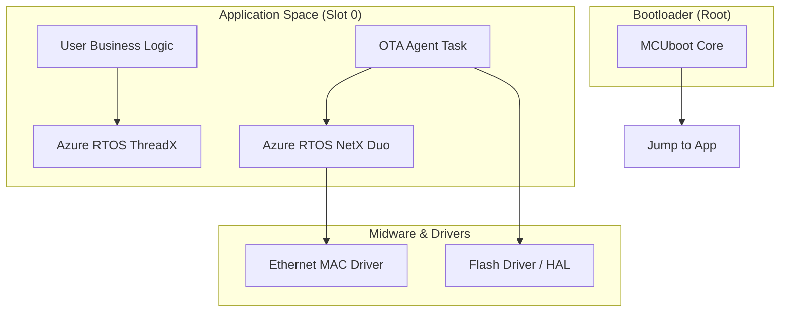
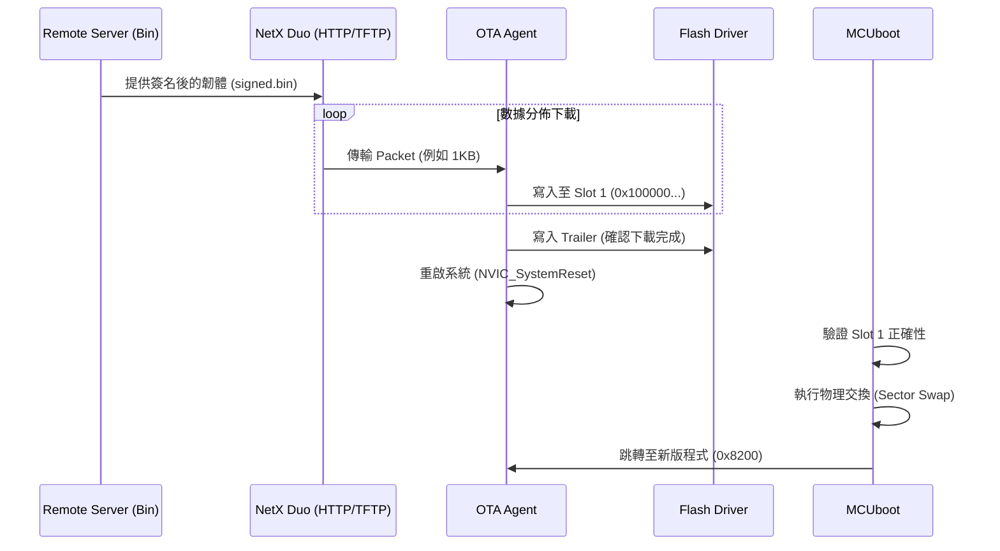

# RA6M5 Ethernet OTA 深度技術架構手冊 (V2.0)

本文件詳述了基於 Azure RTOS 的 RA6M5 乙太網路 OTA 更新計畫。這不僅是一份計畫，更是後續實作的「單一真相來源 (Single Source of Truth)」。

---

## 1. 系統架構圖 (System Stack)

以下展示了系統的軟體層疊架構：

---

## 2. 記憶體詳細區塊定義 (Memory Block Details)

我們必須嚴格定義每個區塊的邊界，避免越界 (Buffer Overflow) 或誤抹除。

### A. Bootloader Block (0x0000 0000 - 0x0000 7FFF)
*   **功能**: 系統的第一個執行點。
*   **關鍵組件**: 
    *   **Image Validator**: 依賴 SHA-256 驗證 Slot 0/1 的完整性。
    *   **Swap Engine**: 負責將新舊韌體按磁區 (Sector) 交換。
    *   **OFS Configuration**: 包含硬體看門狗、電壓偵測等關鍵配置。

### B. Slot 0 - Active Area (0x0000 8000 - 0x000F FFFF)
*   **功能**: 目前正在執行的生產環境代碼。
*   **結構**: 
| 區塊名稱 | 起始位址 | 大小 | 說明 |
| :--- | :--- | :--- | :--- |
| **Slot 0 Header** | `0x0000 8000` | 512 B | MCUboot 專屬簽名與版本資訊 Header |
| **Slot 0 (Active Area)** | **`0x0000 8200`** | ~991 KB | **目前運行的 App 程式碼 (必須在 0x8200 對齊)** |
| **Slot 1 Header** | `0x0010 0000` | 512 B | 下載後存放新韌體的 Header 緩衝區 |
| **Slot 1 (Secondary Area)**| `0x0010 0200` | ~991 KB | **下載回來的新韌體暫存區** |

### C. Slot 1 - Secondary Area (0x0010 0000 - 0x001F 7FFF)
*   **功能**: 下載區。
*   **工作邏輯**: 當 OTA Agent 透過網路收到數據時，會先抹除這塊區域，並將新代碼 (v1.0.1) 逐片寫入。

---

## 3. OTA 數據流向 (Data Flow Sequence)

這展示了當新韌體從伺服器推送到開發板時的完整路徑：

---

## 4. 詳細模組說明 (Module Descriptions)

### 1. NetX Duo Network Stack
*   **作用**: 提供 TCP/IP 存取能力。
*   **關鍵組件**: `nx_http_client` 或直接使用 `TCP Socket`。它必須處理乙太網路的重傳機制，確保下載的 Bin 檔案 1 bit 都不出錯。

### 2. Flash Manager (OTA Agent)
*   **作用**: 管理 Flash 的讀寫生命週期。
*   **防錯機制**: 
    *   **Atomic Write**: 確保在寫入過程中斷電不會導致系統變磚。
    *   **Check-sum**: 下載完成後與簽名進行比對。

### 3. Build Post-Processor (Trimmer)
*   **作用**: 將編譯出來的原始檔案（包含 16MB 的巨大垃圾）進行修剪。
*   **工具**: `llvm-objcopy` + `imgtool`。
*   **結果**: 輸出一個高品質、高度壓縮且具有加密簽名的鏡像。

---

## 5. 技術 KNOW-HOW (開發必備知識)

1.  **VTOR (Vector Table Offset Register)**: RA6M5 在進入應用程式前，必須由 Bootloader 設定 `SCB->VTOR = 0x8200;`。
2.  **ICACHE 清除**: 跳轉前必須 Invalidate 指令快取，並等待硬體 busy bit 清零。
3.  **對齊要求**: Cortex-M33 的向量表必須對齊到 512 bytes（`0x8200` 完美符合官方標準）。
4.  **ThreadX 調度關閉**: 在 OTA 寫入最後那一刻（標記 Trailer），建議暫時關閉 RTOS 切換，保證 Flash 操作的連續性。
5.  **版本控制**: MCUboot 預設「不允許降級」。如果下載的版本號比目前低，MCUboot 會拒絕更新。

---

> [!IMPORTANT]
> **現在的工程共識**：
> 我們這一次建立的 `OTA_RTOS_App` 將會包含 **NetX Duo** 的基礎框架，讓它從一出生就具備「聽從網路指令」的能力。
